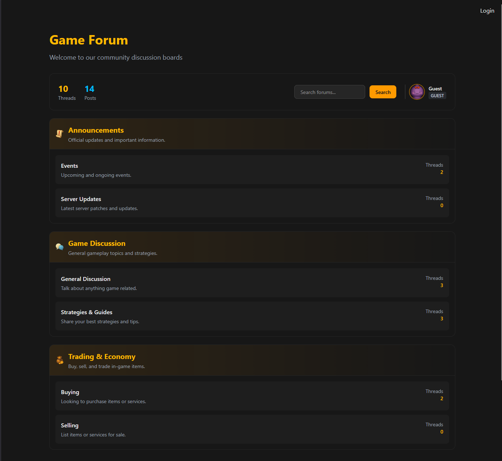
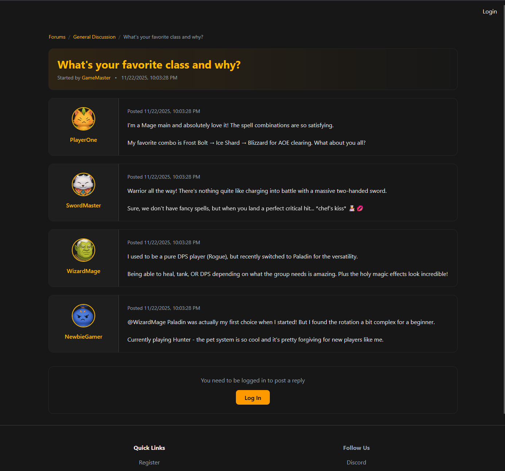
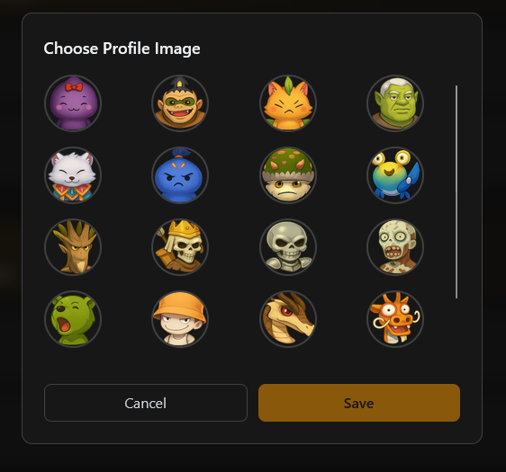

# Community Hub (SvelteKit Forum)

This project is a modern rewrite of a lightweight forum originally built for a personal MMORPG hobby server.  
The first version was integrated into a large Astro-based site (homepage, dashboard, forums all in one).  
To make the system cleaner, more modular, and easier to maintain, the forum has now been rebuilt entirely in **SvelteKit** as a standalone application.

This repository represents the dedicated **Community Hub / Forum** portion of that ecosystem.

---

## Purpose of This Rewrite

The original monolithic Astro project grew complex as features expanded.  
This SvelteKit rewrite focuses on:

- Clean separation between features (authentication, forum, UI)
- A simple, embedded SQLite backend that works immediately with no external services
- A structure optimized for future migration to a real centralized auth system
- Better maintainability and clarity across the codebase
- A forum system that can evolve independently from the rest of the MMORPG tooling

Even though the original concept came from a private-server project, this repo is intentionally neutral and framework-focused.

---

## Screenshots

### Forum Homepage

*Category listing with clean dark theme design*

### Thread View

*Thread with posts, avatars, and reply functionality*

### New Thread Modal

*Modal interface for creating new discussion threads*

### Profile Image Modal

*Modal interface for choosing a profile image*

---

## Current Features

### ✔ Authentication
- Username + password login  
- SQLite sessions stored in cookies  
- Protected routes  
- User state available across layouts  

### ✔ Forum Core
- Category → Thread → Post structure  
- Dynamic routing (`/[slug]/[id]`)  
- Thread header with author + metadata  
- Post list with avatars, timestamps, and usernames  
- Reply form with SvelteKit Actions  
- Server-side validation and redirects  

### ✔ Visual Design
- TailwindCSS dark theme styled after classic fantasy MMO forums  
- Avatar column layout for posts  
- Gradient thread headers  
- Responsive container system  

---

## Asset Disclaimer

Profile avatars used in this project were generated using ChatGPT image generation,  
**loosely inspired by monster designs from Fiesta Online**.

These avatars are:
- original AI-generated artwork  
- **not official Fiesta Online assets**  
- **not owned by Gamigo, OnsOn Soft, or any Fiesta IP holder**

They are included purely for demonstration purposes inside this development project.

---

## Roadmap

Planned enhancements for future iterations of this project:

### 🔧 Authentication / Users
- Centralized auth service integration

### 🎭 Roles & Permissions
- Role system (Admin, Moderator, GM, Member, etc.)  
- Role badges with colors/icons  
- Permission gating:
  - Lock/unlock threads  
  - Sticky/unsticky  
  - Move threads between categories  
  - Edit/delete posts (with audit logs)  

### 📝 Post Features
- BBCode or Markdown formatting  
- Quote system (`[quote]...[/quote]` or @user)  
- Spoilers, code blocks, text styling  
- Image embedding  
- Reactions/emotes  

### 🧹 Moderation Tools
- Soft deletion  
- Report system  
- Moderator dashboard  
- Silent edits + edit history  

### 📄 Thread Features
- Thread tags
- Search functionality

---

This project is not open-source licensed and is intended for personal use and demonstration.
Feel free to adapt ideas or structures from it for your own work, but no license is granted for redistribution.

---